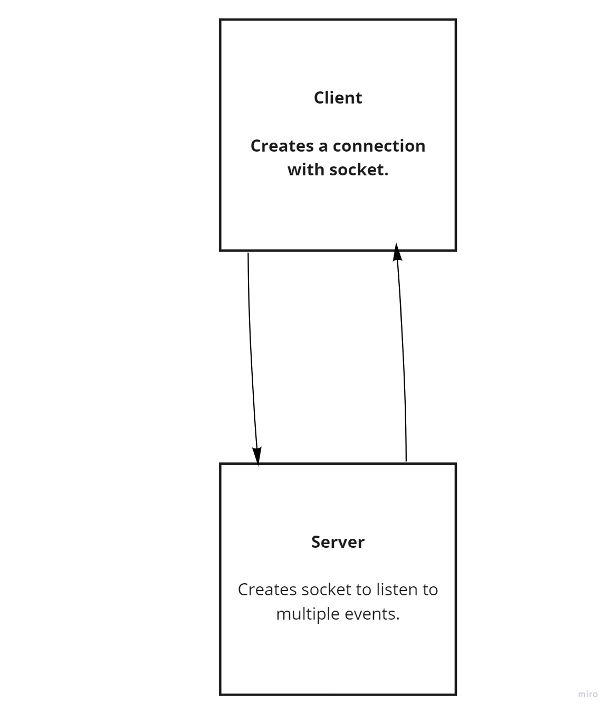

# chat-lab13

1. chatBox

2. Chat rooms between different users to stay connected.

3. For the front-end i used snowpack which is similar to nodemon it gives you a live server 8080 and upadtes when ever anything new is saved.
we also used socket.io and socket.io-client. 

4. nodemon in the server file to run it and snowpack in the client file along with npm start to run the script. 

5. http://localhost:8080/ this is the URL.

### UML

